# Smoking Probability Prediction

Предсказание вероятности того, что человек курит, по медицинским и антропометрическим признакам. Финальный пайплайн использует tree-based модели, Optuna, Confidence Learning и ансамблирование; лучший честный OOF ROC-AUC в ноутбуке — **0.8889**, public leaderboard score — **0.88012**.

## Контекст задачи

Проект решает задачу бинарной классификации: по результатам базового медицинского обследования предсказать наличие привычки курить. Такая модель может быть полезна как учебный пример скоринга поведенческого фактора риска по медицинским данным: она показывает, какие лабораторные и антропометрические признаки сильнее всего связаны с вероятностью курения.

## Данные

В проекте используются contest-данные:

- `train.csv`: **15 000 наблюдений**, 23 признака + целевая переменная `smoking`
- `test.csv`: **10 000 наблюдений**, 23 признака
- `sample_submission.csv`: шаблон отправки
- целевая переменная: `smoking` (`1` — человек курит, `0` — не курит)
- баланс классов в train: примерно **36.7% smoking** и **63.3% not smoking**

Основные группы признаков:

- антропометрия: возраст, рост, вес, талия
- зрение и слух: показатели левого/правого глаза и уха
- давление: systolic, relaxation
- лабораторные показатели: cholesterol, triglyceride, HDL, LDL, hemoglobin, creatinine, AST, ALT, Gtp
- бинарные/категориальные медицинские признаки: urine protein, dental caries

После feature engineering используется **43 признака**.

## Пайплайн

```
Данные → EDA → Feature Engineering → Baseline → Optuna → Cleanlab → Expert Models → Ensemble → Submission
```

### 1. EDA

Проверены размерности, пропуски, баланс классов, распределения ключевых признаков и отличие train/test. Наиболее сильные сигналы связаны с `hemoglobin`, `height(cm)`, `Gtp`, `triglyceride`, `serum creatinine` и производными proxy-признаками.

<p align="center">
  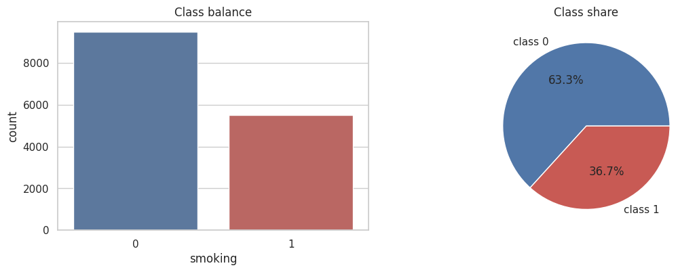
  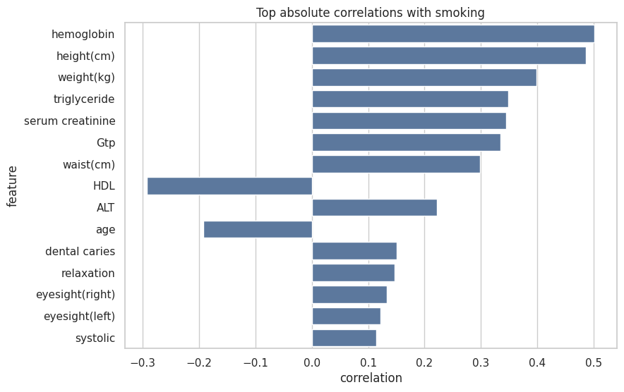
</p>

<p align="center">
  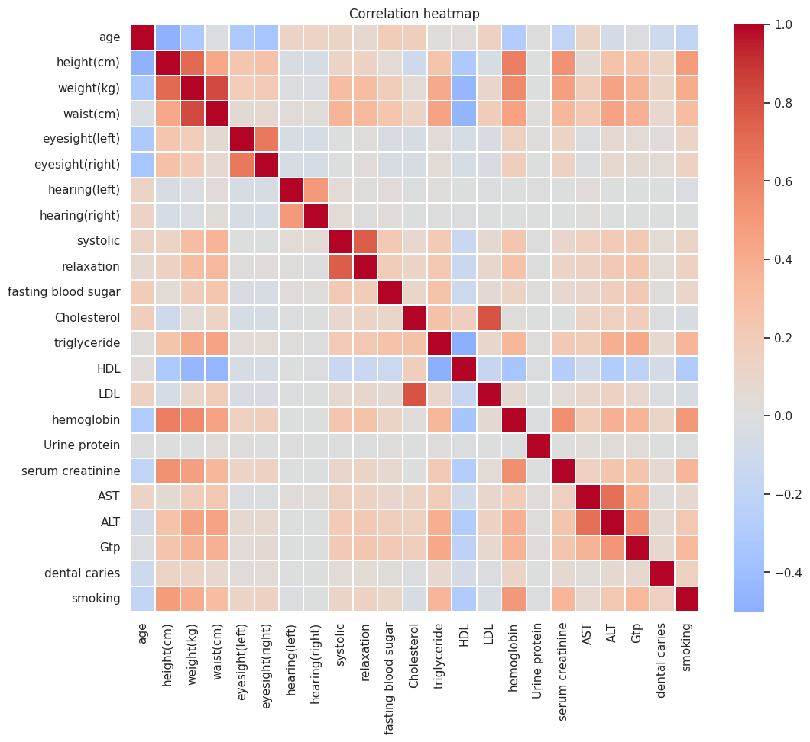
  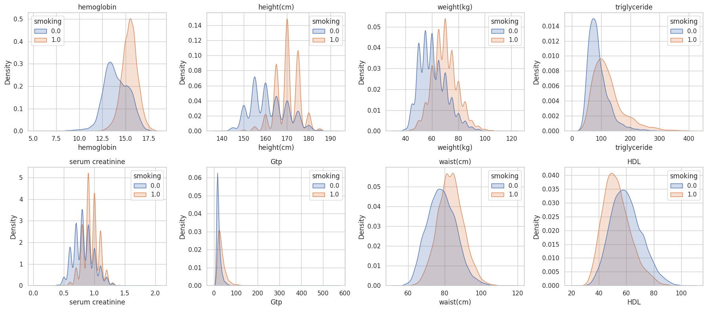
</p>

### 2. Feature Engineering

Добавлены медицински интерпретируемые признаки:

- `BMI`, `pulse_pressure`, `MAP`
- отношения лабораторных показателей: `cholesterol_ratio`, `ldl_hdl_ratio`, `tg_hdl_ratio`, `ast_alt_ratio`
- агрегаты зрения и слуха: `eyesight_diff`, `eyesight_mean`, `hearing_sum`
- proxy/interactions признаки: `height_hemoglobin`, `creatinine_hemoglobin`, `height_weight_ratio`, `hemoglobin_bmi_ratio`, `creatinine_bmi_ratio`, `height_waist_ratio`, `sex_proxy_score`
- `log1p_*` для скошенных признаков `triglyceride`, `Gtp`, `AST`, `ALT`

Контринтуитивная находка: в датасете нет пола, но признаки вроде роста, гемоглобина и креатинина частично кодируют этот фактор. Proxy/interactions признаки стали одними из самых важных в CatBoost feature importance.

### 3. Моделирование

Использованы три сильные tree-based модели:

- CatBoostClassifier
- LightGBMClassifier
- XGBoostClassifier

Гиперпараметры подбирались через Optuna по **5-fold Stratified CV** с метрикой ROC-AUC. SMOTE проверялся только внутри CV-pipeline, чтобы избежать leakage.

<p align="center">
  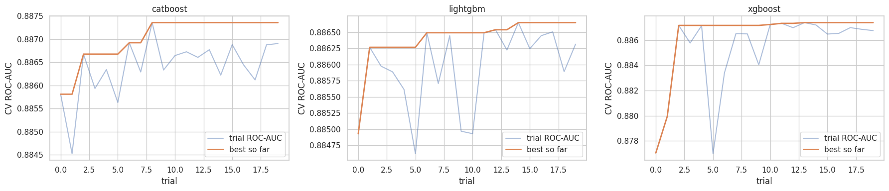
</p>

### 4. Confidence Learning

Cleanlab использовался для поиска потенциально шумных или сложных объектов по out-of-fold вероятностям. Эти объекты не удалялись без проверки: сравнивались стратегии удаления top 0%, 0.5%, 1%, 2% и 3% наиболее подозрительных строк.

<p align="center">
  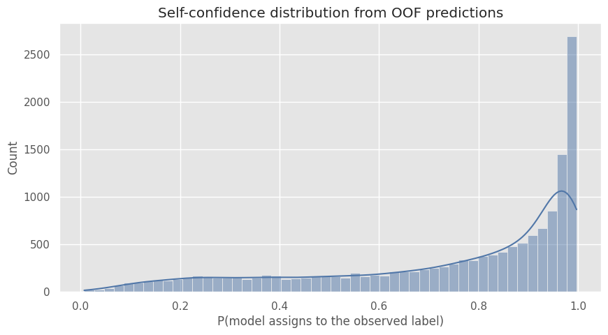
  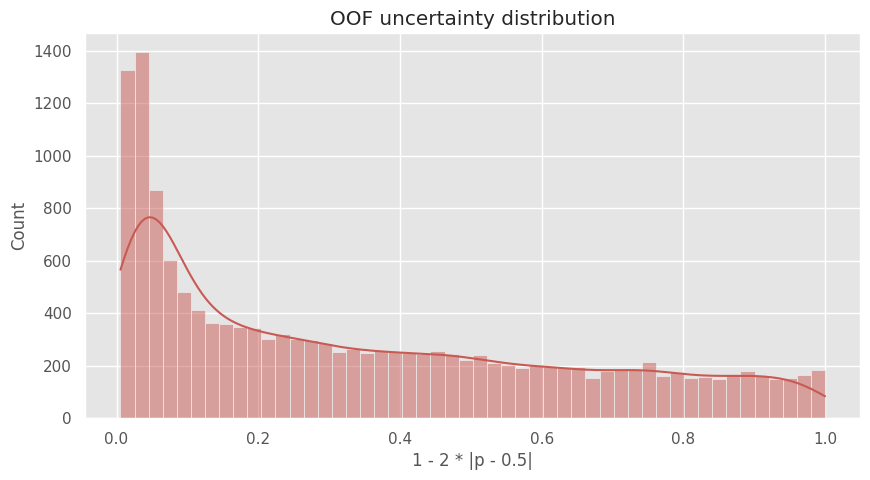
</p>

### 5. Ансамблирование

Проверены несколько финальных конфигураций:

- weighted blend CatBoost + LightGBM + XGBoost
- rank-average ансамбль
- clean expert на очищенной части train
- hard/noisy expert на сложных объектах
- uncertainty-gated blend без использования true labels в gate

Важная корректировка: вариант с label-dependent gate был исключён из финального выбора, потому что завышал OOF ROC-AUC и не переносился на test.

<p align="center">
  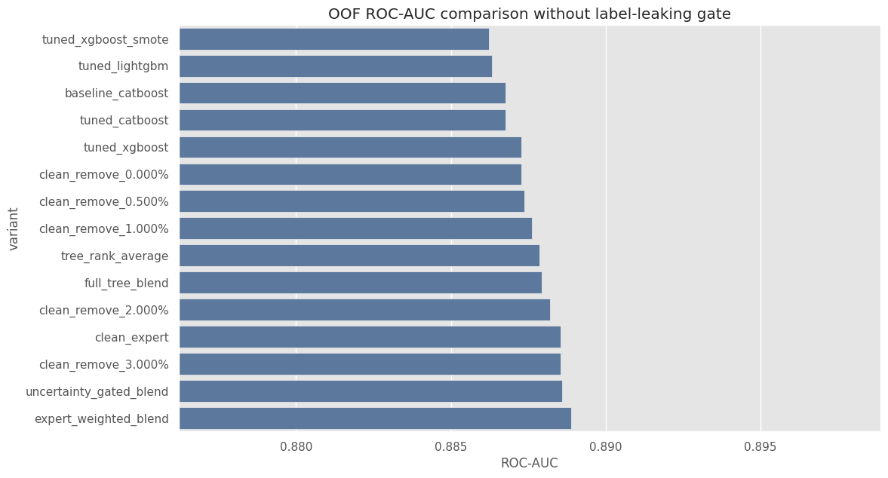
  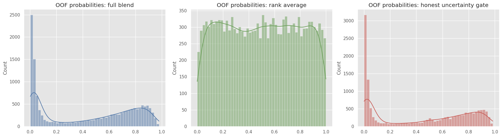
</p>

## Результаты

| Модель / стратегия | OOF ROC-AUC |
|---|---:|
| Expert weighted blend | **0.8889** |
| Uncertainty-gated blend | 0.8886 |
| Cleanlab remove top 3% / clean expert | 0.8885 |
| Full tree blend | 0.8879 |
| Tree rank-average | 0.8879 |
| Tuned XGBoost | 0.8873 |
| Tuned CatBoost | 0.8868 |
| Tuned LightGBM | 0.8863 |
| Baseline CatBoost | 0.8868 |

Итоговый public leaderboard score: **0.88012**.

Ключевые выводы:

- SMOTE не улучшил ROC-AUC для бустингов: для этой задачи важнее порядок вероятностей, чем искусственная балансировка классов.
- Cleanlab-очистка дала небольшой прирост OOF ROC-AUC, но требует осторожности из-за риска переобучения под CV.
- Hard/noisy expert сам по себе слабый, но как часть blend может добавлять сигнал на сложных объектах.
- Самые сильные признаки в финальной модели — `height_hemoglobin`, `sex_proxy_score`, `Gtp`, `height(cm)`, `creatinine_bmi_ratio`, `triglyceride`.

<p align="center">
  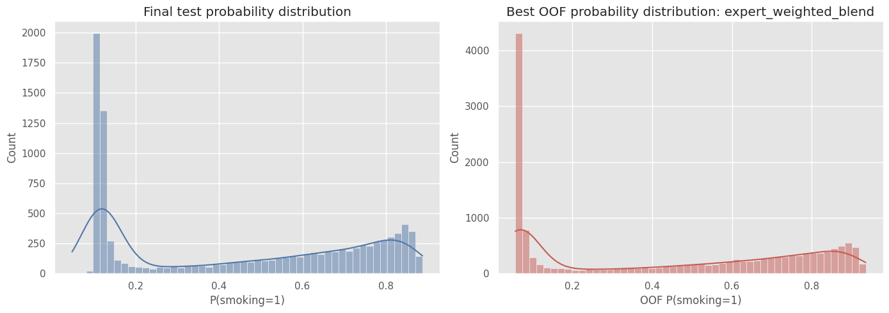
  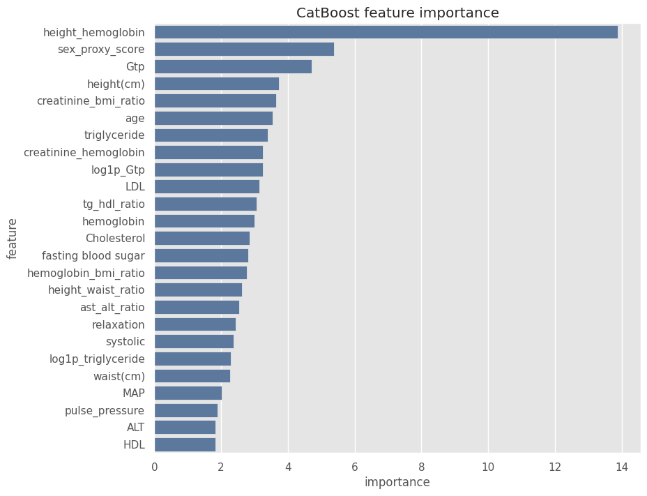
</p>

## Структура репозитория

```
smoking-probability-prediction/
├── data/
│   ├── train.csv                 # обучающая выборка
│   ├── test.csv                  # тестовая выборка
│   └── sample_submission.csv     # шаблон отправки
├── notebooks/
│   └── smoking_probability_prediction.ipynb
├── plots/
│   ├── 01_class_balance.png
│   ├── 02_correlation_heatmap.png
│   ├── ...
│   └── 12_feature_importance.png
├── reports/
│   ├── model_summary.md          # краткий отчёт по метрикам
│   └── submission.csv            # финальная отправка
├── README.md
├── requirements.txt
├── .gitignore
└── LICENSE
```

## Как запустить

```bash
git clone https://github.com/Sav1nDm1tr11/smoking-probability-prediction.git
cd smoking-probability-prediction
python -m venv .venv
source .venv/bin/activate  # Windows: .venv\Scripts\activate
pip install -r requirements.txt
jupyter notebook notebooks/smoking_probability_prediction.ipynb
```

В ноутбуке данные читаются через относительный путь `../data/`, поэтому его нужно запускать из папки `notebooks/` или через Jupyter с сохранённой структурой репозитория.

## Стек технологий

- Python
- pandas, NumPy
- scikit-learn
- CatBoost, LightGBM, XGBoost
- Optuna
- Cleanlab
- imbalanced-learn
- matplotlib, seaborn
- Jupyter Notebook

## Навыки, применённые в проекте

- постановка задачи бинарной классификации и выбор метрики ROC-AUC
- exploratory data analysis медицинских табличных данных
- feature engineering с медицински интерпретируемыми признаками
- работа с дисбалансом классов и проверка SMOTE без leakage
- обучение и сравнение tree-based моделей
- подбор гиперпараметров через Optuna
- out-of-fold validation и контроль переобучения
- Confidence Learning / Cleanlab для анализа потенциально шумных меток
- построение экспертных моделей для clean/hard subsets
- ансамблирование вероятностей и rank averaging
- анализ feature importance и формулирование выводов для бизнеса
- подготовка проекта к публикации на GitHub

## Лицензия

Проект распространяется под лицензией MIT. См. файл [LICENSE](LICENSE).
